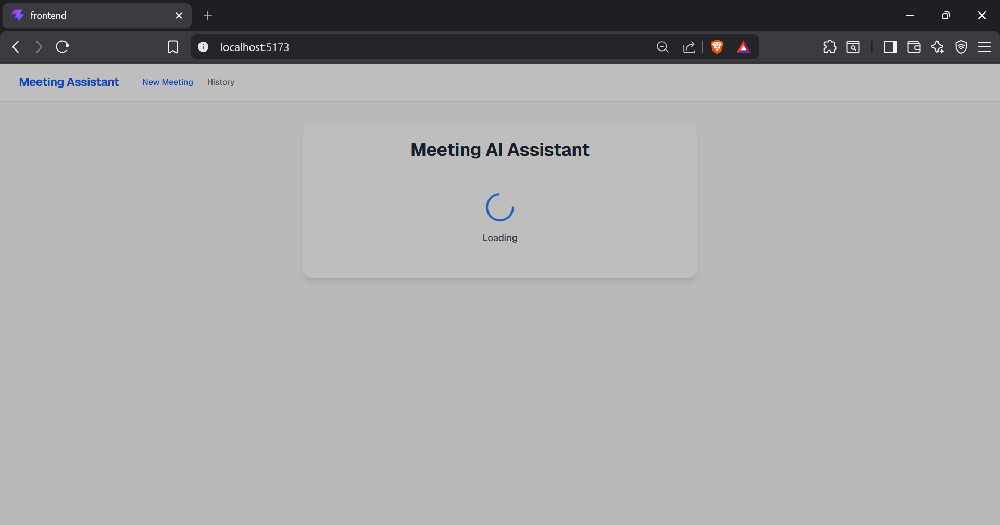
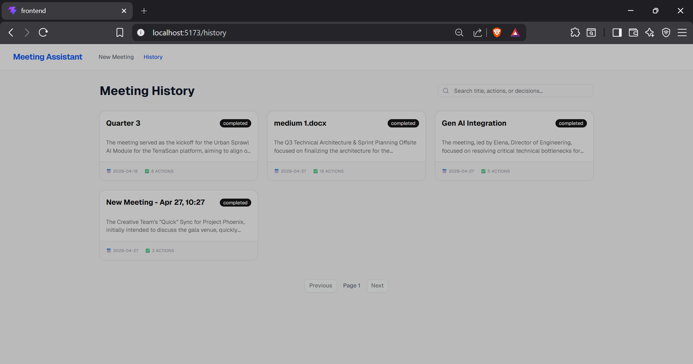

Meeting Assistant 
The Meeting-to-Execution Assistant is an AI-powered platform designed to transform raw meeting transcripts and text notes into structured, actionable insights. By leveraging an advanced automated extraction pipeline, the application instantly generates executive summaries, tracks assigned action items, logs key decisions, and drafts ready-to-send follow-up emails.

Problem Statement
Despite being essential for collaboration, modern meetings often produce unstructured transcripts that require hours of manual review to identify key takeaways, decisions, and responsibilities. This tool exists to eliminate that administrative fatigue by instantly transforming raw meeting notes into structured, accountable data. By automating the extraction of action items and follow-up materials, it ensures that valuable momentum is never lost and teams can transition seamlessly from discussion to execution.

Features
* **Instant Executive Summaries:** Automatically generates both bite-sized overviews and detailed summaries of the meeting's core discussions.
* **Smart Action Item Extraction:** Identifies tasks and assigns owners, deadlines, and priority levels based on conversation context.
* **Decision & Blocker Tracking:** Extracts finalized decisions and highlights potential risks or blockers raised during the meeting.
* **Automated Follow-up Drafts:** Generates a professional, ready-to-send follow-up email summarizing the meeting for attendees.
* **Flexible Input Methods:** Support for both direct text/transcript pasting and file uploads.
* **Historical Dashboard:** A fully paginated meeting history view to manage past transcripts and extracted data.
* **Deep Search Functionality:** Search capabilities allowing users to find specific meetings based on titles, keywords in summaries, or specific action items.

Tech Stack
* Frontend: React + Vite
* Backend: FastAPI
* Database: PostgreSQL
* AI: Google Gemini 1.5 Flash
* Deployment: Vercel + Railway + Neon

Live Demo
* Frontend: (https://meeting-assistant-red.vercel.app/)
* Backend API: meeting-assistant-production-c3d4.up.railway.app

Screenshots
### 1. Data Ingestion & Processing
Users can submit meeting transcripts via direct text input or file upload. The system provides real-time asynchronous polling while the AI processes the data.

**Direct Text Input:**

**Transcript File Upload:**

**Real-time Processing Indicator:**

*(Note: Robust error handling is built-in to catch AI pipeline or formatting failures gracefully).*

---

### 2. The AI Extraction Results
Once processed, the unstructured transcript is transformed into a clean, actionable dashboard.

**Executive & Detailed Summaries:**

**Action Items & Core Decisions:**

**Automated Follow-up Email Draft:**

---

### 3. Historical Dashboard
Users can search, review, and manage all past meetings in a fully paginated historical dashboard.

**Meeting History Grid:**

**Empty State Handling:**

**Historical Detail View:**

Getting Started
Prerequisites
* Python 3.11+
* Node.js 18+
* PostgreSQL
* Gemini API key

Backend Setup
BASH
cd backend
python -m venv venv
source venv/bin/activate  # or venv\Scripts\activate on Windows
pip install -r requirements.txt
cp .env.example .env

Edit .env with your database URL and API key
uvicorn app.main:app --reload Frontend Setup
BASH
cd frontend
npm install
cp .env.example .env

Edit .env with your backend URL
npm run dev Database Setup
Create database
createdb meeting_assistant
Tables are created automatically on first run

API Documentation: https://meeting-assistant-production-c3d4.up.railway.app/docs
Architecture: [View Architecture Documentation](docs/architecture.md)
How AI Processing Works:
## AI Pipeline & Data Extraction

The application uses an asynchronous pipeline powered by **Gemini 2.5 Flash** to convert meeting transcripts into structured data. It focuses on reliable extraction and error handling to ensure data consistency.

* **Error Handling:** Uses the `tenacity` library for exponential backoff retries and includes a 60-second timeout to manage API stability.
* **Prompt Grounding:** Uses specific system instructions to ensure the AI only extracts information explicitly stated in the input text, reducing hallucinations.
* **System Logging:** Every API call tracks token usage, model latency, and retry counts. This metadata is stored in the database for auditing and performance monitoring.
* **Validation Layer:** A post-extraction check verifies that the AI response contains all required fields before saving to the database.

For a detailed look at the logic and prompts, see: [docs/AI_DESIGN.md](docs/AI_DESIGN.md)

##  Known Limitations

* **Context Window Constraints:** The pipeline is optimized for short to medium transcripts. Processing extremely long meetings may result in lower summary precision or truncated output.
* **Speaker Identification:** Entity extraction relies on explicit mentions in the text. If names are missing or ambiguous in the transcript, the AI may categorize owners and decision-makers as "Not identified."
* **Standalone Context:** Each meeting is processed in isolation. The system does not currently support cross-meeting context or long-term tracking of action items across different sessions.
* **Input Format:** Only text-based inputs (direct paste or .txt/.docx/pdf extraction) are supported. Direct audio or video processing is not currently implemented.
* **Latent Processing:** Due to the depth of the extraction prompts, processing times typically range from 20 to 60 seconds.

## Future Roadmap

* **Native Audio/Video Support:** Integration with speech-to-text engines to allow direct processing of meeting recordings without requiring manual transcription.
* **User Authentication:** Implementation of secure login (OAuth2) to support private user accounts and multi-device synchronization.
* **Advanced Search:** Upgrading the search engine to use PostgreSQL `tsvector` for full-text indexing, providing faster and more relevant keyword ranking.
* **Document Export:** Functionality to download meeting summaries and action items as formatted PDF or Markdown files.
* **Action Item Tracking:** A centralized dashboard to monitor the status of tasks across multiple meetings and projects.